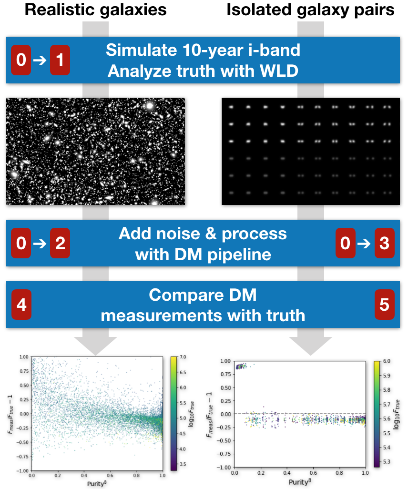

# Hands-On Blending

This tutorial consists of several related self-study activities. Refer to the numbered steps below for the tutorial(s)
you are interested in following.

## 0: Prepare to Run at NERSC

Tutorials intended to be run via a jupyter session at NERSC require some initial setup.  Detailed instructions are [here](NERSC.md)

## 1: Simulate Realistic Galaxies

Since this tutorial is intended to be run at NERSC, you will need to complete Step-0 first.

...

## 2: Process Realistic Galaxies with the DM Pipeline

Since this tutorial is intended to be run at NERSC, you will need to complete Step-0 first.

Navigate to your `Blending_tutorial` directory in the jupyter browser, and click on the `Process.ipynb` notebook to launch this tutorial.

## 3: Process Isolated Galaxy Pairs with the DM Pipeline

Since this tutorial is intended to be run at NERSC, you will need to complete Step-0 first.

Navigate to your `Blending_tutorial` directory in the jupyter browser, and click on the `Two_galaxy_blends.ipynb` notebook to launch this tutorial.

## 4: Analyze Realistic Blended Galaxies

This step can be run on your laptop by downloding files saved from the earlier steps.

...

## 5: Analyze Isolated Blended Galaxy Pairs

This step can be run on your laptop by downloding files saved from the earlier steps.

...

### Version History

- Version 1.00 used during the LSST DESC 2018 Collaboration Meeting [11-12:30 Thu 8-Feb-2018](https://confluence.slac.stanford.edu/display/LSSTDESC/Hands-on+blending%3A+simulation+and+pipeline+tutorial)
